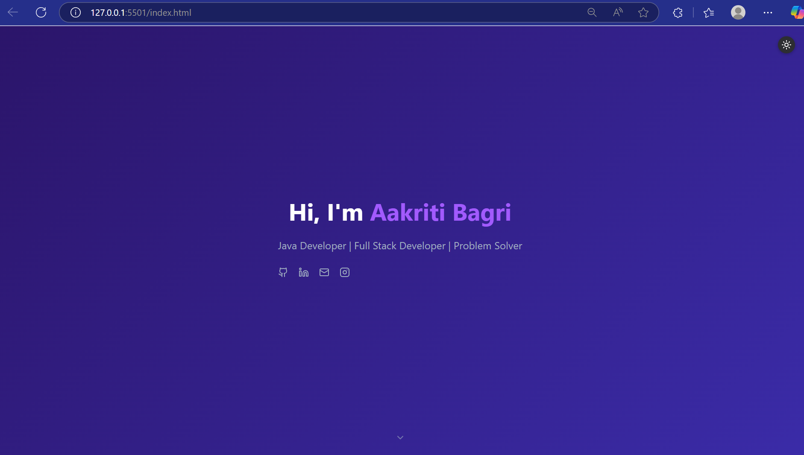
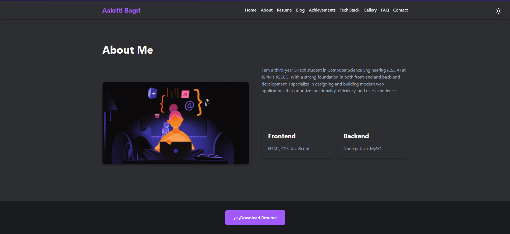

# Student-Portfolio

Hi I am Aakriti Bagri. This is my Student profile project .</p
                                                                # 🎓 Student Profile Project

A dynamic web-based application to manage and showcase student profiles — including personal details, academic achievements, skills, and more — designed for educational institutions, hackathon teams, and career platforms.

## 🚀 Features

- 👤 Student registration & profile creation  
- 📚 Academic & project details  
- 🏆 Achievements & certifications section   
- 📄 Resume download feature

## 🛠 Tech Stack

- **Frontend**: HTML5, CSS3, JavaScript  
- **Version Control**: Git + GitHub

## 📸 Screenshots

